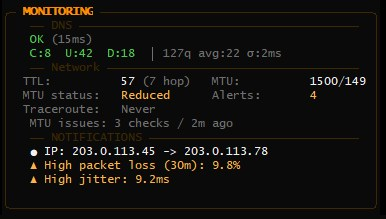

<div align="center">

# Pinger

**Асинхронный сетевой мониторинг с терминальным интерфейсом в реальном времени**

[Русский](README.ru.md) · [English](README.md)

<p align="center">
  <a href="https://pypi.org/project/network-pinger/"></a>
  <a href="python.org"></a>
  <a href="LICENSE"></a>
  <a href=""></a>
  <br>
  <a href="https://github.com/meshlg/_pinger/stargazers"></a>
  <a href="https://github.com/meshlg/_pinger/network"></a>
  <a href="https://github.com/meshlg/_pinger/issues"></a>
  <a href="https://pypi.org/project/network-pinger/"></a>
</p>

<p><em>Асинхронный инструмент для мониторинга сети с терминальным интерфейсом на основе Rich, умными оповещениями, DNS-бенчмарками, отслеживанием здоровья хопов и автоматической диагностикой проблем.</em></p>

<p>
  <a href="#quick-start"><kbd>✴︎ Быстрый старт</kbd></a>
  <a href="#features"><kbd>▣ Обзор функций</kbd></a>
  <a href="#configuration"><kbd>⚒︎ Настройка</kbd></a>
  <a href="#deployment"><kbd>⚓︎ Развертывание</kbd></a>
</p>

<div align="center">
  <sub>Метрики в реальном времени · Умные оповещения · DNS-аналитика · Prometheus-ready</sub>
</div>


</div>

> **Работает везде:** Windows, Linux и macOS с системными командами `ping` и `traceroute` (`tracert` на Windows).
>
> [!WARNING]
> **Уведомление о безопасности:** Не запускайте Pinger от имени root/администратора. Приложение использует системные команды (`ping`, `traceroute`), которые не требуют повышенных привилегий для базовой работы. Запуск от root увеличивает риск эскалации привилегий в случае эксплуатации уязвимостей.

---

## О проекте

**Pinger** — это профессиональный инструмент для мониторинга сетевого соединения в реальном времени, предназначенный для системных администраторов, DevOps-инженеров и энтузиастов, которым важна надёжность и прозрачность работы сети.

### Ключевые преимущества

| Преимущество | Описание |
|--------------|-----------|
| **Мониторинг в реальном времени** | Визуализация задержек, потерь пакетов, джиттера и p95 метрик с обновлением каждую секунду |
| **Интуитивный терминальный интерфейс** | Красивый UI на основе библиотеки Rich с цветовым кодированием статусов и прогресс-баров |
| **Гибкая конфигурация** | Все настройки через переменные окружения — легко адаптировать под любые требования |
| **Многоуровневая диагностика** | Автоматическое определение источника проблем (ISP/локальная сеть/DNS/MTU) на основе паттернов |
| **Интеграция с Prometheus** | Нативная поддержка метрик для мониторинга и алертинга |
| **Docker/Kubernetes готовность** | Helm chart и docker-compose для быстрого развёртывания в контейнерах |
| **Локализация** | Поддержка русского и английского языков с автоматическим определением |
| **Безопасность** | Обязательная аутентификация для публичных health endpoints |

### Для кого это

- **Системные администраторы** — мониторинг состояния сетевой инфраструктуры
- **DevOps-инженеры** — интеграция с системами мониторинга (Prometheus, Grafana)
- **Разработчики** — отладка сетевых проблем и анализ маршрутизации
- **Энтузиасты** — визуализация качества домашнего соединения

---

## Быстрый старт

> [!IMPORTANT]
> Python 3.10+ обязателен, а также системные команды `ping` и `traceroute` (`tracert` на Windows).

### Установка через pipx (рекомендуется)

```bash
pipx install network-pinger
pinger
```

Нажмите `Ctrl+C` для корректной остановки.

```bash
pipx upgrade network-pinger
```

### Установка через pip

```bash
python -m pip install --upgrade network-pinger
pinger
```

### Установка из исходников

```bash
git clone https://github.com/meshlg/_pinger.git
cd _pinger
pip install -r requirements.txt
python pinger.py
```

---

## Функциональность

Шесть панелей в реальном времени отслеживают состояние вашего соединения — от задержек на краю до анализа маршрутов.

### ✴︎ Мониторинг пинга

- Метрики в реальном времени: текущая / лучшая / средняя / пиковая / медиана / джиттер / p95
- Двойные sparkline-графики и Unicode-прогресс-бары для визуализации дрейфа
- Обнаружение потерь пакетов с счётчиком последовательных потерь и p95 метрикой задержки

### ✧ DNS-мониторинг и бенчмаркинг

- Параллельный мониторинг записей A, AAAA, CNAME, MX, TXT и NS
- Встроенный набор тестов для бенчмаркинга:

| Тест | Что измеряет |
|------|---------------|
| **Cached** | Ответ DNS из кэша (повторный запрос) |
| **Uncached** | Полная рекурсивная резолвция со случайным поддоменом |
| **DotCom** | Время ответа популярного .com домена |

- Статистика: минимум / среднее / максимум / стандартное отклонение / надёжность
- Цветовые бейджи: зелёный (быстро) / жёлтый (медленно) / красный (ошибка)
- Сравнение нескольких DNS-резолверов параллельно

### ⚑ Умные оповещения



- Аудио + визуальные оповещения для задержки, джиттера, потерь пакетов и разрывов связи
- Гистерезис для предотвращения мерцания — оповещения срабатывают только при изменении состояния
- **Умные функции:**
  - **Дедупликация** — предотвращает повторяющиеся уведомления об одной проблеме
  - **Группировка** — объединяет связанные оповещения в одно
  - **Адаптивные пороги** — автоматически изучает нормальное поведение сети
  - **Защита от усталости** — подавляет шум во время длительных инцидентов
- Лента оповещений с временными метками для корреляции проблем

### ✪ Анализ проблем и прогнозирование

- Автоматическая классификация проблем: ISP / локальная сеть / DNS / MTU
- Поиск повторяющихся инцидентов и прогнозирование их возвращения
- Контекст маршрута плюс тренды потерь/джиттера для быстрого определения причины

### ⌁ Мониторинг здоровья хопов

### ⌁ Мониторинг здоровья хопов
 
 - Обнаружение хопов через traceroute, затем параллельный пинг каждого хопа
 - **Богатая диагностика**: Sparkline-графики истории, джиттер, дельта задержек
 - **Геолокация**: Определение провайдера (ASN) и страны для каждого узла
 - Таблица с цветовым кодированием и статус-индикаторами (🟢/🟡/🔴)
 - Идеально для выявления перегрузки, смены маршрутов или проблем на магистралях

### ☲ Анализ маршрутов

- Обнаружение изменений маршрута с настраиваемой чувствительностью и таймерами охлаждения
- Автоматическое сохранение снимков traceroute в директорию `traceroutes/` при проблемах
- Помогает доказать изменения маршрутизации при обращении в техподдержку ISP

### ⌂ Сетевые метрики

- **Публичный IP** — отслеживание изменений с геолокацией и информацией об AS
- **MTU / Path MTU** — обнаружение и фрагментация пакетов
- **TTL** — оценка количества хопов и обнаружение аномалий

### ▤ Наблюдаемость

- **`/metrics`** — Prometheus endpoint на порту 8000 для сбора метрик
- **`/health`** и **`/ready`** — health probes на порту 8001 для Kubernetes/Docker
- Docker + Helm манифесты для развёртывания в контейнерах

### ☷ Локализация

- Автоматическое определение системной локали с поддержкой **русского** и **английского** языков
- Переопределение языка в `config.py`:

```python
# config.py
CURRENT_LANGUAGE = "en"  # или "ru"
```

---

## Интерфейс

> [!NOTE]
> Каждая панель обновляется в реальном времени. Сопоставьте скриншот выше с этой картой для быстрой ориентации.

### 1. Заголовок и статус-бар

- Целевой IP, версия с индикатором обновления, лампа соединения (● Подключено / ▲ Деградация / ✕ Отключено) и время работы
- Текущий пинг, потери за 30 минут, время работы и публичный IP

### 2. Панель задержек

- Текущая / лучшая / средняя / пиковая / медиана / джиттер / p95 метрика
- Двойные sparkline-графики для задержек и джиттера с отслеживанием последних значений

### 3. Панель статистики

- Счётчики пакетов: отправлено / успешно / потеряно
- Процент успеха и потери за 30 минут
- Прогресс-бары и мини-панель трендов (потери 30м, тренд джиттера, количество хопов)

### 4. Панель анализа

- Классификатор проблемы (ISP / локальная сеть / DNS / MTU / неизвестно)
- Прогноз (стабильно / риск проблем)
- Паттерн проблем
- Стабильность маршрута (изменён / стабилен) и время последнего изменения

### 5. Панель мониторинга

- Здоровье DNS-записей (A, AAAA, CNAME, MX, TXT, NS)
- Плитки бенчмаркинга (Cached / Uncached / DotCom) со статистикой
- Состояние MTU / Path MTU / TTL и фрагментации
- Лента активных оповещений

### 6. Панель здоровья хопов

### 6. Панель здоровья хопов
 
 - Таблица маршрута с полной диагностикой (Мин/Ср/Посл, Потери, Джиттер)
 - Sparkline-графики истории задержек прямо в таблице (во всех режимах)
 - Информация о Провайдере (ASN) и Стране (Loc) для широких экранов
 - Статус-индикаторы для мгновенной оценки здоровья узла

---

## Конфигурация

Все настройки находятся в [`config.py`](config.py) с дефолтными значениями и комментариями.

> [!TIP]
> Скопируйте `config.py` рядом с бинарным файлом или используйте переменные окружения для сохранения кастомных настроек под контролем версий.

### ⚙︎ Основные настройки

```python
TARGET_IP = "8.8.8.8"          # Целевой IP для пинга
INTERVAL = 1                    # Интервал пинга (секунды)
WINDOW_SIZE = 1800              # Окно статистики (30 мин)
LATENCY_WINDOW = 600            # История задержек (10 мин)
ENABLE_PYTHONPING_FALLBACK = True # Включить pythonping fallback (требует root/admin)
```

### ⚑ Пороги и оповещения

```python
PACKET_LOSS_THRESHOLD = 5.0     # Порог потерь пакетов (%)
AVG_LATENCY_THRESHOLD = 100     # Порог средней задержки (мс)
JITTER_THRESHOLD = 30           # Порог джиттера (мс)
CONSECUTIVE_LOSS_THRESHOLD = 5   # Порог последовательных потерь

ENABLE_SOUND_ALERTS = True
ALERT_COOLDOWN = 5              # Минимальный интервал между звуками (секунды)

# Умные функции
ENABLE_SMART_ALERTS = True
ENABLE_ADAPTIVE_THRESHOLDS = True
ADAPTIVE_BASELINE_WINDOW_HOURS = 24
ENABLE_ALERT_DEDUPLICATION = True
ENABLE_ALERT_GROUPING = True
```
```

### ✧ DNS-мониторинг

```python
ENABLE_DNS_MONITORING = True
DNS_TEST_DOMAIN = "cloudflare.com"
DNS_CHECK_INTERVAL = 10
DNS_SLOW_THRESHOLD = 100        # Порог "медленного" ответа (мс)
DNS_RECORD_TYPES = ["A", "AAAA", "CNAME", "MX", "TXT", "NS"]

ENABLE_DNS_BENCHMARK = True
DNS_BENCHMARK_SERVERS = ["system"]  # или ["1.1.1.1", "8.8.8.8"]
```

### ⌂ IP / MTU / TTL

```python
ENABLE_IP_CHANGE_ALERT = True
IP_CHECK_INTERVAL = 15

ENABLE_MTU_MONITORING = True
MTU_CHECK_INTERVAL = 30
```

### ⌁ Traceroute и мониторинг хопов

```python
ENABLE_AUTO_TRACEROUTE = False   # Ручной запуск или при изменении маршрута
TRACEROUTE_TRIGGER_LOSSES = 3
TRACEROUTE_COOLDOWN = 300
TRACEROUTE_MAX_HOPS = 15

ENABLE_HOP_MONITORING = True
HOP_PING_INTERVAL = 1
HOP_PING_TIMEOUT = 0.5
HOP_LATENCY_GOOD = 50          # Зелёный (мс)
HOP_LATENCY_WARN = 100         # Жёлтый (мс), выше = красный
```

### ✪ Анализ

```python
ENABLE_PROBLEM_ANALYSIS = True
PROBLEM_ANALYSIS_INTERVAL = 60

ENABLE_ROUTE_ANALYSIS = True
ROUTE_ANALYSIS_INTERVAL = 1800
ROUTE_CHANGE_CONSECUTIVE = 2
```

### 🔄 Проверка версии

```python
ENABLE_VERSION_CHECK = True
VERSION_CHECK_INTERVAL = 3600  # Проверять каждый час (секунды)
```


Приложение автоматически проверяет наличие обновлений каждый час (настраивается). Когда доступна новая версия, вы увидите индикатор в заголовке:

- `v2.3.1 → v2.4.0` — Доступно обновление (жёлтая стрелка)
- `v2.3.1 ✓` — Актуальная версия (зелёная галочка)
- `v2.3.1` — Проверка ещё не выполнялась

Чтобы отключить проверку версии:

```bash
export ENABLE_VERSION_CHECK=false
```

Чтобы изменить интервал проверки (например, каждые 30 минут):

```bash
export VERSION_CHECK_INTERVAL=1800
```

---

## Развертывание

<div align="center">
<table>
  <tr>
    <td><strong>⚓︎ Docker Compose</strong></td>
    <td><strong>♘ Kubernetes (Helm)</strong></td>
  </tr>
  <tr>
    <td>Локальная лаборатория с Prometheus и health ports.</td>
    <td>Кластерная готовность с values overrides для production.</td>
  </tr>
</table>
</div>

### ⚓︎ Docker Compose

> [!WARNING]
> При привязке health endpoint к `0.0.0.0` **требуется** аутентификация. По умолчанию `docker-compose.yml` использует Basic Auth с `HEALTH_AUTH_USER=admin` и `HEALTH_AUTH_PASS=${HEALTH_AUTH_PASS:-changeme}`. **Измените пароль по умолчанию** через переменную окружения или файл `.env` перед развёртыванием.

```bash
docker compose up -d
```

| Сервис | Порт | Описание |
|--------|------|-----------|
| `pinger` | `8000` | Prometheus metrics (`/metrics`). |
| `pinger` | `8001` | Health probes (`/health`, `/ready`). |
| `prometheus` | `9090` | Prometheus UI. |

### ♘ Kubernetes (Helm)

```bash
helm install pinger ./charts/pinger -f charts/pinger/values.yaml
```

Нужны настройки? См. [`charts/pinger/README.md`](charts/pinger/README.md) для тегов образов, секретов и примечаний по обновлению.

---

## Часто задаваемые вопросы (FAQ)

### ❓ Как диагностировать проблемы с соединением?

Pinger автоматически классифицирует проблемы в панели анализа:

| Тип проблемы | Признаки | Что делать |
|--------------|----------|------------|
| **ISP** | Высокие задержки на хопах 2-5, потери пакетов на маршруте | Свяжитесь с провайдером, покажите снимки traceroute |
| **Локальная сеть** | Потери на первом хопе, проблемы с роутером | Проверьте кабель, перезагрузите роутер |
| **DNS** | Медленные DNS-запросы, но пинг по IP нормальный | Смените DNS-сервер (1.1.1.1, 8.8.8.8) |
| **MTU** | Фрагментация пакетов, проблемы с VPN | Уменьшите MTU на интерфейсе |

### ❓ Почему пинг показывает потери, но интернет работает?

Это нормально для некоторых провайдеров:
- ICMP-пакеты могут иметь низкий приоритет
- Некоторые маршрутизаторы ограничивают ICMP-трафик
- Проверьте потери на хопах — если только на одном, это может быть нормой

### ❓ Как настроить оповещения?

```python
# config.py
ENABLE_SOUND_ALERTS = True
ALERT_COOLDOWN = 5              # Минимальный интервал между звуками (секунды)
PACKET_LOSS_THRESHOLD = 5.0     # Порог потерь пакетов (%)
AVG_LATENCY_THRESHOLD = 100     # Порог средней задержки (мс)
JITTER_THRESHOLD = 30           # Порог джиттера (мс)
```

### ❓ Как интегрировать с Prometheus?

Pinger предоставляет метрики на порту 8000:

```yaml
# prometheus.yml
scrape_configs:
  - job_name: 'pinger'
    static_configs:
      - targets: ['localhost:8000']
```

### ❓ Как использовать в Kubernetes?

```bash
helm install pinger ./charts/pinger -f charts/pinger/values.yaml
```

Health endpoints доступны на порту 8001:
- `/health` — проверка работоспособности
- `/ready` — проверка готовности

### ❓ Как сменить язык интерфейса?

```python
# config.py
CURRENT_LANGUAGE = "en"  # или "ru"
```

Язык определяется автоматически по системной локали.

### ❓ Как сохранить результаты мониторинга?

Pinger автоматически сохраняет снимки traceroute при проблемах в директорию `traceroutes/`. Для постоянного логирования используйте Prometheus.

### ❓ Как запустить в фоновом режиме?

```bash
# Linux/macOS
nohup pinger > pinger.log 2>&1 &

# Windows
start /B pinger > pinger.log 2>&1
```

### ❓ Как проверить health endpoints?

```bash
# Health check
curl http://localhost:8001/health

# Readiness check
curl http://localhost:8001/ready

# Prometheus metrics
curl http://localhost:8000/metrics
```

### ❓ Как настроить аутентификацию для health endpoints?

```bash
# Basic Auth
export HEALTH_AUTH_USER=admin
export HEALTH_AUTH_PASS=secret

# Token Auth
export HEALTH_TOKEN=your-secret-token
export HEALTH_TOKEN_HEADER=X-Health-Token

# Доверенные прокси (для rate limit за reverse proxy)
export HEALTH_TRUSTED_PROXIES="127.0.0.1,10.0.0.0/8"
```

Подробнее см. [`SECURITY.md`](SECURITY.md).

---

## Для разработчиков

```bash
pip install poetry
git clone https://github.com/meshlg/_pinger.git
cd _pinger
poetry install
poetry run pinger
```

1. Используйте Poetry для изолированных окружений и зафиксированных зависимостей.
2. Запустите `poetry run pytest` перед открытием PR.
3. Следуйте [CONTRIBUTING.md](CONTRIBUTING.md) для релизов и тегирования (помните о git-тегах для уведомлений об обновлениях).

---

<div align="center">

**[MIT License](LICENSE)** · 2026 © meshlg  
✉︎ [Присоединяйтесь к Discord](https://discordapp.com/users/268440099828662274) · ⚑ [Сообщите о проблеме](https://github.com/meshlg/_pinger/issues/new/choose) · ☆ [Звезду репозиторию](https://github.com/meshlg/_pinger/stargazers)

</div>
