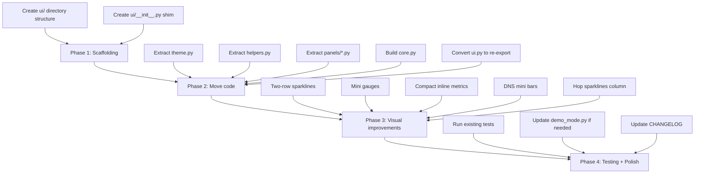

# UI Refactor Plan — Rich-based Redesign

## Цель

Декомпозировать монолитный [`ui.py`](../ui.py) (~1200 строк) на модульную структуру `ui/` и улучшить визуальную часть: более компактный layout, улучшенные графики, gauge-элементы, убрать лишние пустые строки.

## Текущее состояние

```
ui.py (1 файл, ~1200 строк)
├── Style constants & Unicode elements
├── MonitorUI class
│   ├── Tier detection (_get_tier, _get_height_tier)
│   ├── Helpers (_fmt_uptime, _sparkline, _progress_bar, _kv_table, ...)
│   ├── _render_header()
│   ├── _render_toast()
│   ├── _render_dashboard()
│   ├── _render_metrics_panel()     ← Latency + Stats
│   ├── _render_analysis_panel()    ← Problems + Route + DNS + Network
│   ├── _render_hop_panel()         ← Hop Health table
│   ├── _render_footer()
│   └── generate_layout()           ← Layout assembly
```

## Целевая структура

```
ui/
├── __init__.py              # Re-exports MonitorUI for backward compat
├── core.py                  # MonitorUI class: constructor, generate_layout, tier detection
├── theme.py                 # Style constants, Unicode elements (moved from top of ui.py)
├── helpers.py               # Static helpers: _fmt_uptime, _fmt_since, _sparkline,
│                            #   _progress_bar, _kv_table, _dual_kv_table, _section_header,
│                            #   _truncate, _render_sparkline, _render_trend_arrow,
│                            #   _lat_color, _get_connection_state
├── panels/
│   ├── __init__.py
│   ├── header.py            # _render_header()
│   ├── toast.py             # _render_toast()
│   ├── dashboard.py         # _render_dashboard()
│   ├── metrics.py           # _render_metrics_panel() — Latency + Stats
│   ├── analysis.py          # _render_analysis_panel() — Problems + Route + DNS + Network
│   ├── hops.py              # _render_hop_panel() — Hop Health table
│   └── footer.py            # _render_footer()
```

### Backward compatibility

Текущий [`ui.py`](../ui.py) останется как thin re-export:

```python
# ui.py — backward compatibility shim
from ui.core import MonitorUI  # noqa: F401

__all__ = ["MonitorUI"]
```

Это гарантирует, что [`main.py`](../main.py), [`demo_mode.py`](../demo_mode.py), тесты и [`pyproject.toml`](../pyproject.toml) продолжат работать без изменений через `from ui import MonitorUI`.

## Визуальные улучшения

### 1. Двухстрочные sparklines

Текущий sparkline — одна строка `▁▂▃▅▇`. Улучшение: верхняя строка — верхняя половина блоков (`▀`, `█`, ` `), нижняя — нижняя (`▄`, `█`, ` `). Это даёт ~16 уровней высоты вместо 8, визуально напоминая реальный график.

### 2. Mini gauges для score/success

Вместо текстового `Success: 97.2%` + полоса — добавить компактный «arc gauge»:

```
 ◉ 97.2% ━━━━━━━━━━━━━━━━━╌╌╌
```

С иконками состояния: `◉` (ok), `◎` (warn), `◗` (critical).

### 3. Compact metrics — inline pairs

В compact mode: ключ-значения в одну строку через разделители вместо 4-колоночной таблицы:

```
 Cur:13.1 Avg:4.3 Best:11.9 Med:12.5 P95:13.1 Jit:1.3
```

### 4. DNS section — mini bar chart

Визуализация DNS response times через горизонтальные мини-бары:

```
 A    ✓  18ms ████░░  TTL:300
 AAAA ✓  42ms ████████░  TTL:300
 NS   ✓   8ms ██░░░░  TTL:3600
```

### 5. Hop table — inline sparklines per hop

Каждый hop получает мини-спарклайн из последних 6 значений:

```
 #  Avg  Last  Loss  ~      Host
 1   2     1    0%  ▁▂▁▂▁▂  gateway.local
 2   9     9    0%  ▃▅▃▄▃▅  isp-gw-1.example.net
```

### 6. Connection status — визуальный индикатор

Вместо plain text:

```
 ● CONNECTED │ ▲ 13.1ms │ ▼ 2.8% │ ⏱ 2h 34m │ 🌐 203.0.113.78
```

### 7. Убрать лишние пустые строки

В dense/compact режимах — ноль пустых строк между секциями. В standard — максимум одна. Это уже частично сделано в предыдущей итерации.

## Порядок реализации



## Зависимости и риски

- **Нет новых зависимостей** — всё в рамках `rich ^13.7.0`
- **Backward compat** — thin shim в [`ui.py`](../ui.py) сохраняет все import paths
- **Тесты** — [`tests/test_regressions_security_runtime.py`](../tests/test_regressions_security_runtime.py) тестирует `MonitorUI` напрямую; shim обеспечит совместимость
- **[`demo_mode.py`](../demo_mode.py)** — использует `from ui import MonitorUI`; shim обеспечит совместимость
- **[`pyproject.toml`](../pyproject.toml)** — включает `ui.py`; нужно будет добавить `ui` package
